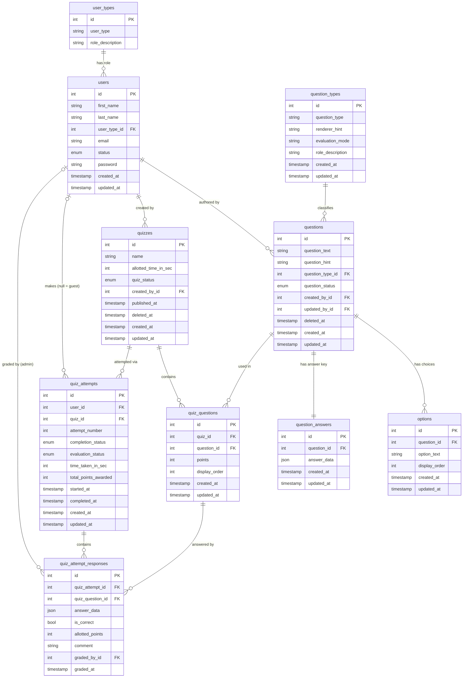

# Data Model — Quiz Management Platform

> This document covers the relational schema, key design decisions, and extensibility

---

## Entity-Relationship Diagram



---

## Design Decisions

### 1. `question_types` — data-driven, not hardcoded

The five question kinds (`binary`, `single_choice`, `multiple_choice`, `number_input`,
`text_input`) are rows in a lookup table, not a hardcoded enum.

Each row carries two behaviour-driving columns:

| Column | Purpose |
|--------|---------|
| `renderer_hint` | Tells the UI which component to render (`toggle`, `radio`, `checkbox`, `number`, `textarea`) |
| `evaluation_mode` | Tells the grading engine whether to auto-grade (`auto`) or queue for manual review (`manual`) |

**Extensibility impact:** adding a new question type — `ranking`, `file_upload`, `code_snippet` —
requires inserting one row and writing one evaluator class. No schema changes, no switch
statements to update.

---

### 2. Reusable question bank (`questions` + `quiz_questions`)

Questions are **not** created inside a quiz. They live in a shared bank, and quizzes reference
them via the `quiz_questions` pivot.

```
questions  ──────  quiz_questions  ──────  quizzes
                    (points, order)
```

**Consequences:**
- The same question can appear in multiple quizzes with **different point values** (stored on
  `quiz_questions.points`, not on `questions`)
- Questions can be authored and reviewed before being attached to any quiz
- Deactivating a question does not affect any quiz already using it

---

### 3. Polymorphic answer storage via JSON

Both the **answer key** (`question_answers.answer_data`) and **user responses**
(`quiz_attempt_responses.answer_data`) are stored as JSON.

Different question types produce structurally different answers:

| Type | `answer_data` shape |
|------|---------------------|
| `binary` | `{"value": true}` |
| `single_choice` | `{"option_id": 3}` |
| `multiple_choice` | `{"option_ids": [2, 4]}` |
| `number_input` | `{"value": 42}` |
| `text_input` | `{"value": "...", "model_answer": "..."}` |

A typed JSON column avoids needing separate answer tables per question type. Each type's
evaluator class knows exactly which keys to read. New shapes slot in without altering the schema.

---

### 4. `question_answers` as a separate table

The correct answer is **not** a column on `questions`. It lives in a dedicated
`question_answers` row.

**Why:**
- The answer shape varies by type — a nullable JSON column on `questions` would work but blurs
  the concern of "what the question is" vs "what the correct answer is"
- Keeps the question definition clean and importable without exposing answer keys to read queries
  that don't need them (e.g. listing the question bank)

---

### 5. `quiz_attempt_responses` references `quiz_questions`, not `questions`

A response row stores `quiz_question_id`, not `question_id` directly.

```
quiz_attempt_responses.quiz_question_id  →  quiz_questions  →  questions
                                               (points, order,
                                                quiz context)
```

**Why this matters:** `quiz_questions` holds the point value and display order as they were
when the attempt was taken. If a question were ever repurposed in a new quiz with different
points, old responses would still resolve to the correct per-quiz context.

---

### 6. Integrity without snapshotting — publish-time immutability

A common exam-platform pattern is to **copy** question text into each attempt at submission
time. This project takes a different approach: content is **locked at publish time and never
modified thereafter**.

```
Draft  →  Active (locked)  →  Inactive
            │
        No edits allowed — returns 403
```

- A question moves `Draft → Active`: text, options, and answer key are frozen
- A quiz moves `Draft → Active`: question list, point values, and order are frozen
- All `quiz_attempt_responses` resolve to a `quiz_questions` row that is itself frozen

This gives the same integrity guarantee as snapshotting with **zero data duplication**.
Historic attempts always describe exactly the question the user answered.

---

### 7. Guest support via nullable `user_id`

`quiz_attempts.user_id` is **nullable**. A `NULL` value means the attempt belongs to a guest
(session-tracked). Authenticated users have a FK to `users`.

This required no separate guest-attempt table. The same attempt and response records work for
both access types; reporting queries simply filter on `user_id IS NULL` or `IS NOT NULL`.

---

### 8. Soft deletes on quizzes and questions

Both tables carry a `deleted_at` timestamp. Hard deletes are never used once content has been
published, because `quiz_questions`, `quiz_attempts`, and `quiz_attempt_responses` all reference
those rows. A soft delete hides the content from the UI while keeping every FK valid and every
historic attempt intact.

Draft questions are the only content that can be hard-deleted — they carry no attempt references.

---

### 9. Dual evaluation status

Evaluation state is tracked at two levels:

| Level | Column | Values |
|-------|--------|--------|
| **Attempt** | `quiz_attempts.evaluation_status` | `Pending`, `AutoGraded`, `FullyGraded` |
| **Response** | `quiz_attempt_responses` (per-row) | auto-graded inline; manual rows awaited |

Auto-graded questions are resolved immediately on submission. Text responses stay pending until
an admin grades them. When the last pending response is graded, the parent attempt is promoted
to `FullyGraded` and `total_points_awarded` is recalculated.

---

## Extensibility Summary

| Change | What it requires |
|--------|-----------------|
| Add a new question type | Insert 1 row in `question_types`, write 1 evaluator class, add 1 Livewire renderer |
| Support multiple attempts per user | Already modelled — `attempt_number` on `quiz_attempts` |
| Add a time limit to a quiz | `quizzes.allotted_time_in_sec` already present (nullable) |
| Support guest quiz-taking | Already modelled — `user_id` is nullable |
| Add manual grading | Already modelled — `graded_by_id`, `comment`, `graded_at` on responses |
| Add more user roles | Insert 1 row in `user_types`; middleware checks a single FK |
| Retire content without losing history | Soft deletes + `Inactive` status, already in place |

No schema changes are needed for any of the above — they are either already implemented or
require only application-layer additions.
